# Hate Speech Detection - Indonesian Language

Klasifikasi Ujaran Kebencian (Hate Speech) dalam Bahasa Indonesia menggunakan **Naive Bayes** dan **TF-IDF**. Proyek ini merupakan implementasi dari tugas UTS Kecerdasan Buatan untuk mendeteksi konten berbahaya di media sosial.

---

## 📌 Deskripsi Proyek

Proyek ini bertujuan untuk **mendeteksi ujaran kebencian** dalam tweet berbahasa Indonesia menggunakan pendekatan Machine Learning. Dataset yang digunakan adalah **ID Hate Speech Dataset** yang terdiri dari 713 tweet dengan label:
- **Non_HS** (Non Hate Speech): Tweet yang tidak mengandung ujaran kebencian
- **HS** (Hate Speech): Tweet yang mengandung ujaran kebencian

Model yang dibangun mampu mengklasifikasikan teks dengan akurasi **~88%** menggunakan algoritma **Multinomial Naive Bayes** dan representasi fitur **TF-IDF**.

---

## 🎯 Fitur Utama

- ✅ **Preprocessing Teks Lengkap** (Case folding, Cleaning, Tokenisasi, Stopword Removal, Stemming)
- ✅ **Handling Imbalanced Data** dengan Under-Sampling
- ✅ **TF-IDF Feature Extraction** (Unigram + Bigram)
- ✅ **Model Training** dengan Naive Bayes
- ✅ **Evaluasi Komprehensif** (Confusion Matrix, Accuracy, Precision, Recall, F1-Score)
- ✅ **Visualisasi Data** (Word Cloud, Charts, Heatmap)

---

## 📊 Dataset

**Sumber:** https://github.com/ialfina/id-hatespeech-detection.git

**Catatan:** Dataset tidak seimbang (imbalanced), sehingga dilakukan **Random Under-Sampling** untuk menciptakan distribusi 50%-50%.

---

## 🚀 Instalasi & Penggunaan
## ✅ Langkah 1 – Import Library
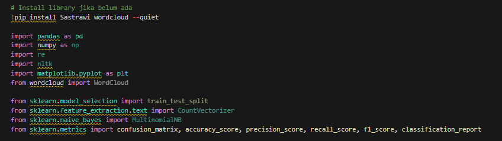
## Load Dataset & batasi 50 kolom pertama
---
from google.colab import files
uploaded = files.upload()

for fn in uploaded.keys():
  print('User uploaded file "{name}" with length {length} bytes'.format(
      name=fn, length=len(uploaded[fn])))

import nltk
import re
nltk.download('punkt')
nltk.download('stopwords')
nltk.download('punkt_tab') # Added this line to download the missing resource

from nltk.corpus import stopwords
stopwords_id = set(stopwords.words('english'))

from Sastrawi.Stemmer.StemmerFactory import StemmerFactory
stemmer = StemmerFactory().create_stemmer()

def preprocess(text):
    # lowercase
    text = text.lower()

    # hapus angka & tanda baca
    text = re.sub(r'[^a-zA-Z\s]', ' ', text)

    # tokenisasi
    tokens = nltk.word_tokenize(text)

    # hapus stopword + kata 1 huruf
    tokens = [t for t in tokens if t not in stopwords_id and len(t) > 1]

    # gabung kembali
    text = ' '.join(tokens)

    # stemming
    text = stemmer.stem(text)

    return text

df = pd.read_csv('ujaran_dataset.csv')

# Ambil hanya 100 baris pertama
df = df.head(50)

# Preprocessing
df['clean_text'] = df['tweet'].astype(str).apply(preprocess)

df.head()
---
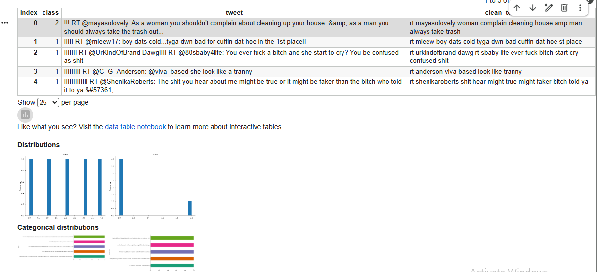
---
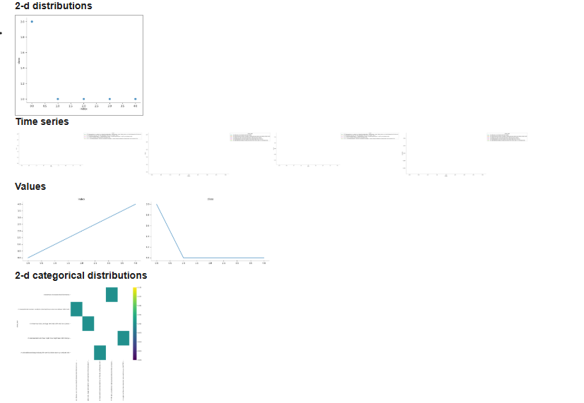
## Membuat dua label untuk Dataset
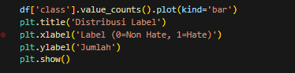
---
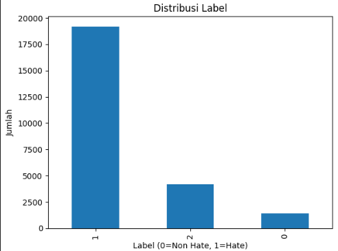
## ✅ Langkah 2 – Preprocessing Teks
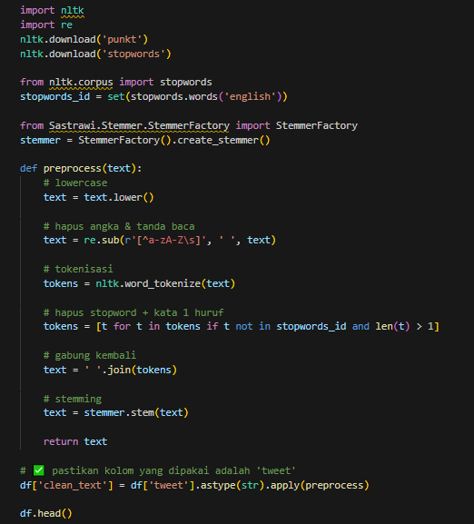
---
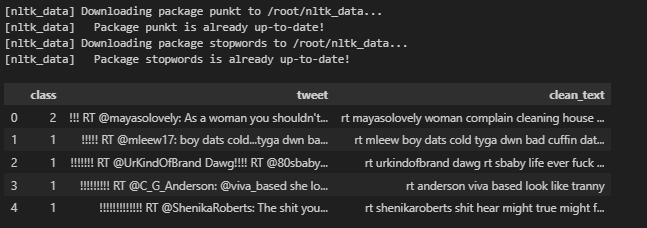
## ✅ Langkah 3 – Representasi Fitur (Bag of Words)
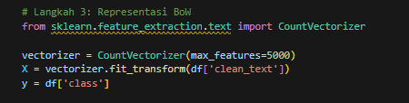
##  ✅ Langkah 4 – Train Model Naive Bayes
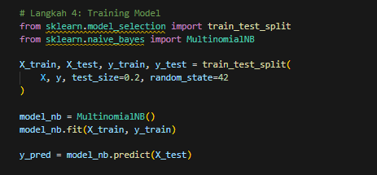
## ✅ Langkah 5 – Evaluasi Model
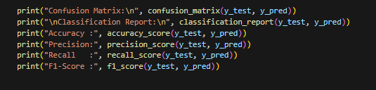
---

## ✅ Langkah 6 – Visualisasi Distribusi Label & Word Cloud
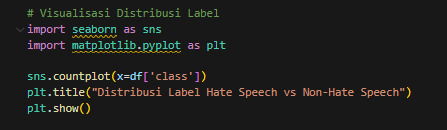
---

---

## Hasil
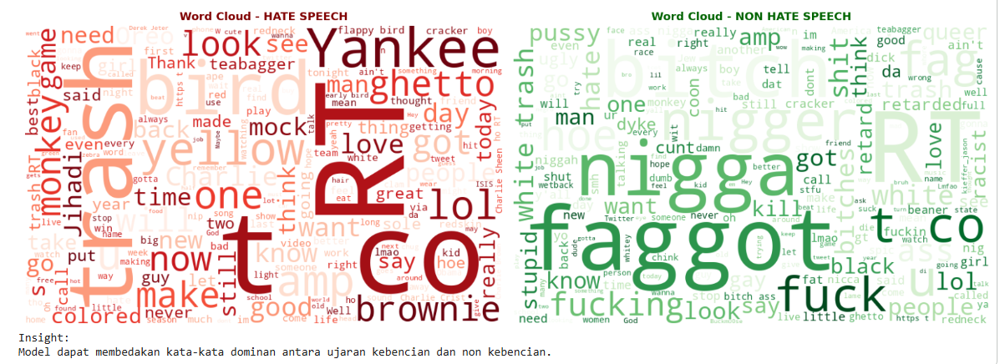

---

## 📌 Catatan

**Disclaimer:** Model ini dibuat untuk tujuan edukatif. Penggunaan untuk deteksi ujaran kebencian di dunia nyata memerlukan pengembangan lebih lanjut dengan dataset yang lebih besar dan diverse.

---
